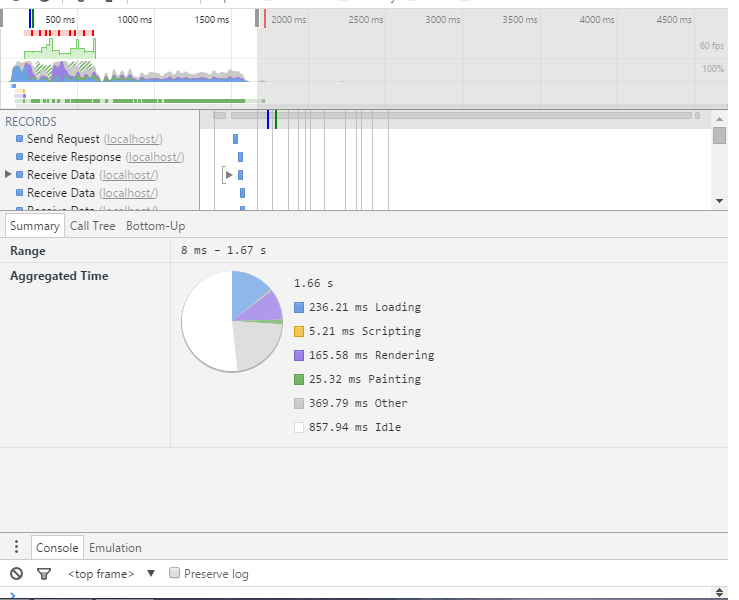
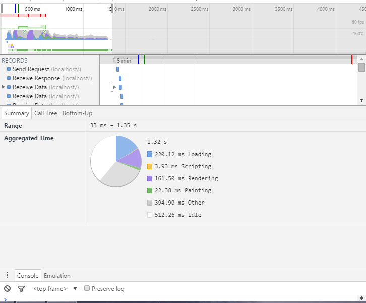
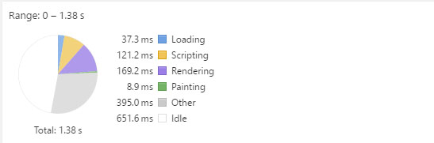

# LookLive server

The project you're looking at is an [express.js](http://expressjs.com) project. You'll use it to get set up a development environment where you're
going to optimize the way this project works. In it's current state, the css is messy, the rendering isn't modern and
overall the product is boring and not efficient. It's up to you to fix this and improve it.

## Getting started

### Step 1 - clone the repo
Github provides some instructions for this and we're assuming that you know how to clone this repo. If you're not sure,
don't hesitate to raise your hand now and ask.

### Step 2 - install dependencies
In order to run the server you'll need to install express.js and it's dependencies. In order to do this, open up a 
terminal and navigate to your project folder (for example `cd ~/Projects/looklive-server`). When you've done this, type
this command to run the instal:

```
npm install
```

That should get you setup.

### Step 3 - running the server
To run the server, stay at the 'root' of your project folder and type:

```
npm start
```

That will get the server to run on port 3000. If you go to [http://localhost:3000](http://localhost:3000) in your browser
you should see an overview page.

## The api

This project comes with a simple API. All you need to know for now is that there's three endpoints:

* `/api/feed/` <- returns a feed of appearances
* `/api/appearance/:uuid` <- returns a single appearance, more detailed than in the feed. Replace `:uuid` with the 
appearance id.
* `/api/product/:uuid` <- returns a single product, including similar and bargain products. Replace `:uuid` with the 
product id.

The API returns JSON (for now).

# Performance

## Spritesheet

By replacing the icon png's to a spritesheet that uses span elements for icon placement, i managed to remove about 15ms from the loading time

### Before Spritesheet



### After Spritesheet



## CSS

Previously the CSS regarding layout was build-up by using floats and clears, by rewriting this to a CSS which is using Flex-Box for layout, i managed to remove quite a bit loading time regarding the Render time.

See detailed testing [here](https://docs.google.com/spreadsheets/d/1kseb1HDXnX40pStBezwGHbe8NSIa5znfb8iNDWwJ6uo/edit#gid=0)

## JQuery

Previously the app used JQuery only to select several elements inside the DOM. This can easily be done without a hefty library like JQuery. By removing JQuery and rewriting the app.js a little bit the scripting time went from 65ms to 4ms.

## Overal

After rewriting some code, removing redundant data and optimizing images i managed to take the loading time from 590ms to 398ms. That is a performance gain of almost 200ms one third of the total.

## Service Worker Caching

These are the results before the SW caching



And these are the results After the SW caching


As you can see the caching scraped 30ms from the rendering, 3ms from the paint and almost 100ms from other processess
a total performance gain of 133ms


# Progressive Web App.

Progressive Web apps are app-like applications on mobile. Basicly its a website wich is "ported" to a application so you can save it on your homescreen.

## What are progressive web apps.

Progressive Web Apps are experiences that combine the best of the web and the best of apps. They are useful to users from the very first visit in a browser tab, no install required. As the user progressively builds a relationship with the App over time, it becomes more and more powerful. It loads quickly, even on flaky networks, sends relevant push notifications, has an icon on the home screen and loads as a top-level, full screen experience. 

Progressive - Work for every user, regardless of browser choice because they’re built with progressive enhancement as a core tenet.
Responsive - Fit any form factor: desktop, mobile, tablet, or whatever is next.
Connectivity independent - Enhanced with service workers to work offline or on low quality networks.
App-like - Feel like an app to the user with app-style interactions and navigation because they’re built on the app shell model.
Fresh - Always up-to-date thanks to the service worker update process.
Safe - Served via HTTPS to prevent snooping and ensure content hasn’t been tampered with.
Discoverable - Are identifiable as “applications” thanks to W3C manifests and service worker registration scope allowing search engines to find them.
Re-engageable - Make re-engagement easy through features like push notifications.
Installable - Allow users to “keep” apps they find most useful on their home screen without the hassle of an app store.
Linkable - Easily share via URL and not require complex installation.


A progressive web app is built with Progressive Enhancement as the core tenant so that they work for as many users as possible irrespective of browser choice. When the User-Agent (such as Chrome, Opera and Firefox) support technologies like Service Worker, Web Push, and the Add to Homescreen banner they can be enhanced to provide a first class native-like experience for the user.

Progressive web apps tend to be architected around the concept of an App Shell. The shell of the functionality is loaded in and displayed to the user (and potentially permanently cached offline) and the content is loaded in dynamically as the user navigates around the app. ()

(definition by Google developers)
[Google Source](https://developers.google.com/web/fundamentals/getting-started/your-first-progressive-web-app/)
[Quora Source](https://www.quora.com/What-are-progressive-web-apps)


